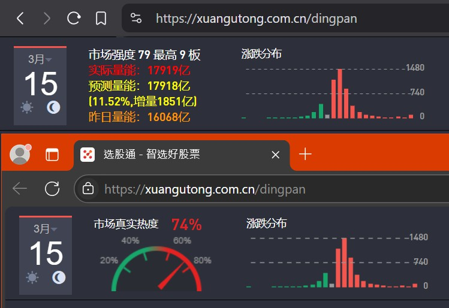
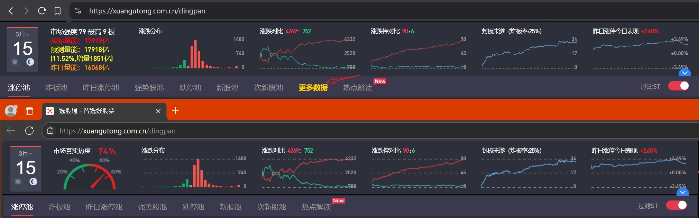
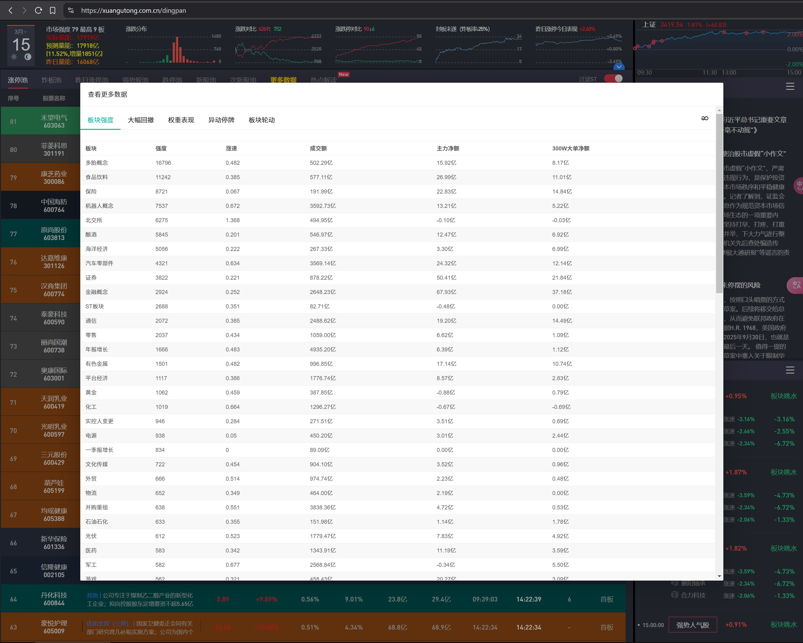
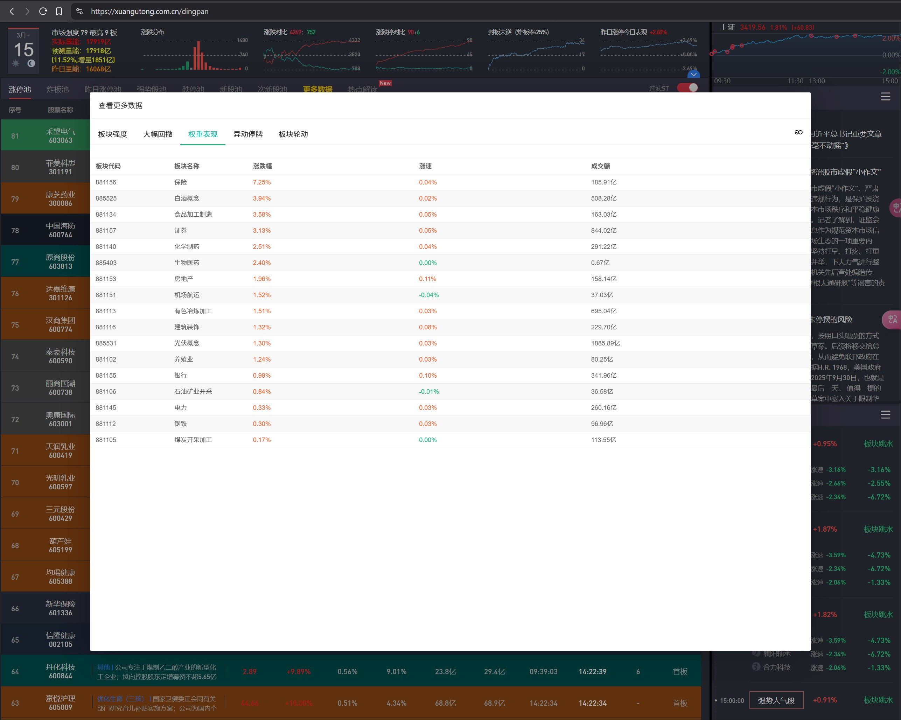
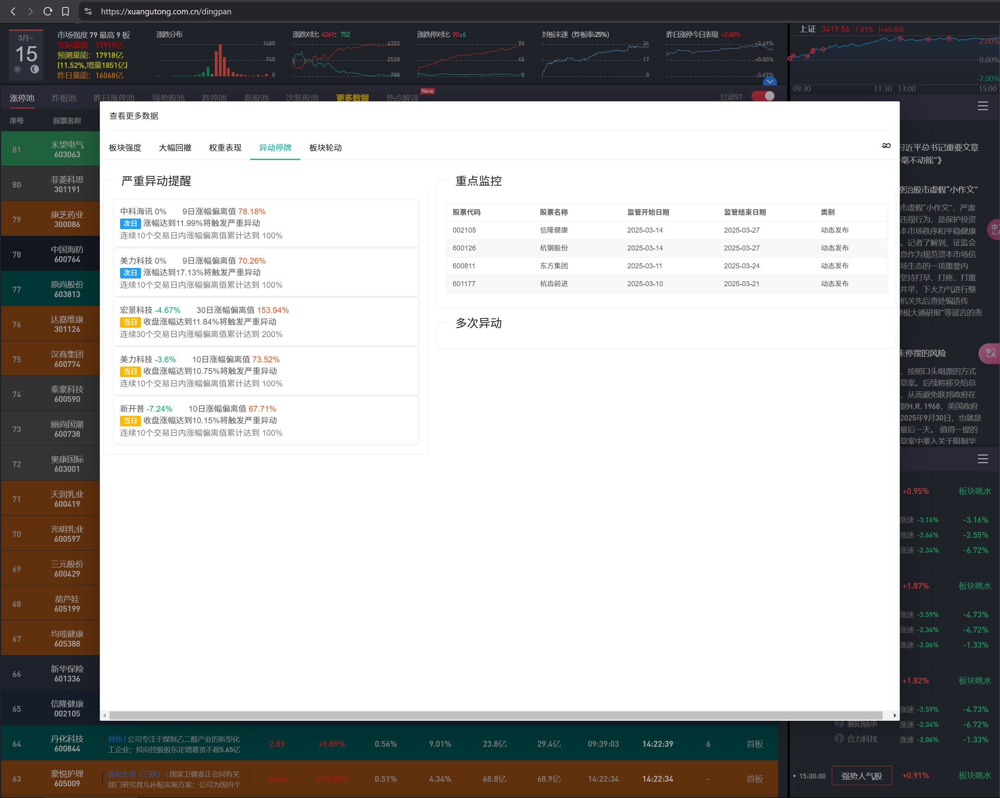
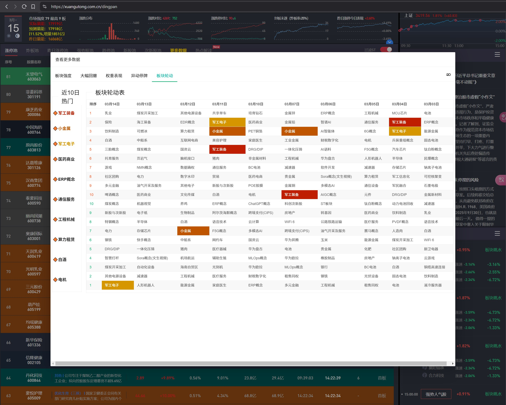

## 选股通盯盘增强

在[选股通盯盘](https://xuangutong.com.cn/dingpan)页面上增加了一些功能，使其更加好用，增加功能如下：

- 默认深色模式（因为有按照板块分类颜色功能，白色模式会导致页面错乱）
- 设置登录过期时间为一年，避免周末不看盘导致登录过期，周一还要登录一次
- 数据表格自动展开最大化，那个图表没什么用，直接关掉
- 新的一天自动刷新页面，原来的页面每天上班还停留在昨天，需要手动刷新一次太麻烦
- 将市场真实热度那个图表替换成成交量数据，实时的哦

    
- 移除数据表格中的水印，无干扰，看的更清晰
- 添加更多实时数据按钮，可以查看更多股市数据，直接起飞

    
  - 板块强度：查看真实的板块强度排序（非直接按涨幅排序），更精准把握主线板块
        
  - 大幅回撤数据：查看昨日涨停，今日大面股票，大面太多，需要谨慎
        
  - 权重表现：查看指数权重板块的表现怎么样，看看是题材强还是权重指数强，做到心中有数
        
  - 异动停牌：查看即将异动股票和进入重点监控的股票，连板高度未突破时还是要注意，一个进入监管期，直接按到地板上摩擦（多次异动数据还未增加，后续再说）
        
  - 板块轮动：查看近10日热门板块都是什么，以及排名靠前的板块的轮动规则，踏好节奏比追涨杀跌更省钱
        
- 数据列表中相同板块的股票设置背景色，更直观看到哪个板块的涨跌停数据最多（背景颜色随机，暂时还不能自定义）

以上就是全部功能介绍了，更多功能看情况增加，祝各位股友天天涨停，月月翻倍，年年发财。

## 手动安装

由于使用了外部UI框架，发布不到greasyfork里面，所以需要手动安装，直接点击油猴扩展，点击创建新脚本，然后打开这个[链接](https://raw.githubusercontent.com/binary4cat/UserScripts/refs/heads/main/xuangubao/xuangubao.js)，把里面的内容复制到打开的编辑器里面，按 `Ctrl + s`保存就可以了，后续更新会直接原链接更新。
